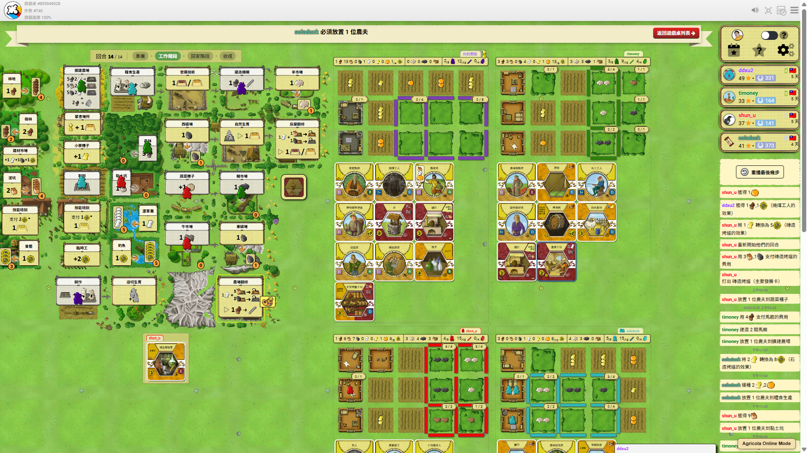
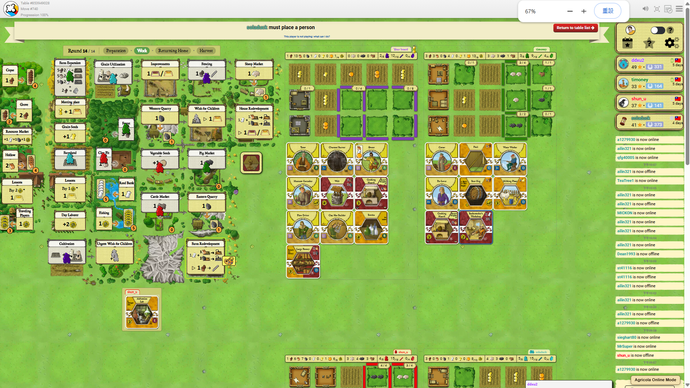
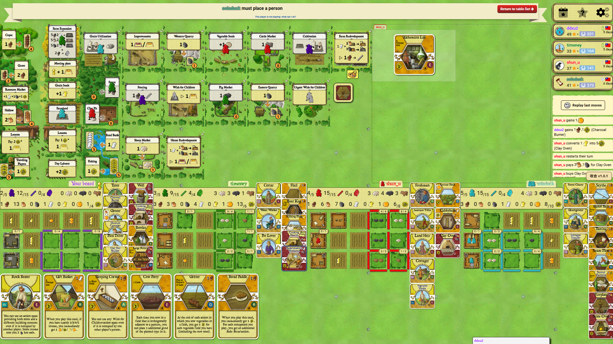

# BGA PlayAgricolaOnline Mode (BGA農家樂緊湊排版模式)

[繁體中文](#繁體中文) | [English](#english)

---

## 繁體中文

這是一個專為 [Board Game Arena (BGA)](https://boardgamearena.com/) 設計的 Chrome / Chromium 瀏覽器擴充功能。它重新整理了農家樂（Agricola）的遊戲桌排版，提供更乾淨、更直覺且好上手的體驗——同時完全保留 BGA 原本的互動、動畫與懸停提示（tooltip）。

### 功能特點

| 調整前 | 調整後 |
|--------|-------|
| 玩家個人板、手牌、行動卡和遊戲記錄散落在長長的網頁上，需要頻繁上下滾動。 | 所有資訊都整合在單一視窗內：中央圖板在上方、農莊板塊在下方，手牌和行動卡整齊排列在中間。 |

**主要功能：**
- **農莊板塊**：緊湊地排列在視窗底部，並依比例縮放以適應螢幕。
- **手牌區域**：顯示在中央版圖右下側，若農莊版圖下側的空間足夠(透過縮放螢幕大小)，會移動到農莊版圖下側。
- **已打出卡牌**（職業與改善）：從每位玩家的板塊向下延伸，善用剩餘空間。
- **卡片標題自適應**：中文卡牌完全維持原版單行（`nowrap`）排版，並在職業卡達 5 字以上、次要發展卡達 4 字以上時，動態加上描白邊的陰影（`text-shadow`）效果以保證可讀性；外語長卡名則啟用折行（最多兩行）與自適應字級微縮以避免遮擋。
- **行動格卡片**：若設定顯示玩家行動卡，會顯示在14回合格的右側。
- **遊戲記錄**：過濾掉好友上線/下線等雜音，只顯示具備遊戲意義的步驟。
- 保留所有 BGA 原有的懸停提示（tooltips）、拖放操作（drag-and-drop）、動畫以及卡牌點擊互動。
- 隨時可以使用右下角的 **BGA PlayAgricolaOnline Mode** 按鈕切換開啟或關閉緊湊排版。

### 介面對照 (Before & After)

| 緊湊排版啟用前 (Before) | 緊湊排版啟用後 (After) |
| :---: | :---: |
|  |  |

---

### 安裝方式 (手動安裝，無需透過 Web Store)

1. **下載**：至 [Releases](../../releases) 頁面下載最新版的 `bga-agricola-compact-panel-v*.zip`，並將其解壓縮到電腦中的固定資料夾。
2. 開啟 Chrome 瀏覽器，進入 `chrome://extensions/`（擴充功能管理頁面）。
3. 開啟右上角的 **「開發者模式」** (Developer mode) 開關。
4. 點擊左上角的 **「載入未封裝項目」** (Load unpacked)，並選擇您剛剛解壓縮的資料夾。
5. 進入 BGA 的任何一局農家樂遊戲——**Agricola Online Mode** 按鈕將會出現在網頁的右下角。

> ⚠️ **注意**：部分 Chrome 版本在啟動時可能會提醒您「開發者模式正在運行」，這是正常且安全的現象，直接關閉該提示（或若無提示）即可。

---

### 使用方式

- 點擊 **Agricola Online Mode** 按鈕即可啟用緊湊排版。
- 點擊控制面板上的 **收合** (非中文語系顯示 **Collapse**) 可隨時還原為 BGA 原本的排版。
- 遇到排版跑版的情況，可以嘗試收合後再次展開此功能。

---

### 相容性

| 瀏覽器 | 支援狀態 |
|---------|--------|
| Chrome 120+ | ✅ 支援 |
| Edge (Chromium) | ✅ 支援 |
| Firefox | ❌ 不支援 (Manifest V3 規格差異) |

本套件適用於 **BGA Agricola (農家樂)**（支援所有擴充）。本功能僅修改遊戲桌面排版，遊戲大廳、個人檔案等其他 BGA 頁面不受影響。

---

### 更新步驟

從 [Releases](../../releases) 下載新的 zip 檔，覆蓋原安裝資料夾中的檔案，然後到 `chrome://extensions/` 點擊該擴充功能卡片上的 **↺ 重新整理 (refresh)** 圖示即可。

---

## English

A Chrome / Chromium browser extension for [Board Game Arena](https://boardgamearena.com/) that reorganises the Agricola table layout for a cleaner, more playable experience — without losing any of BGA's original interactions, animations, or tooltips.

### What it does

| Before | After |
|--------|-------|
| Boards, hand, action cards and log are scattered across a wide scrolling page | Everything fits in a single viewport: central board top, farm boards bottom, hand and action cards in between |

**Key features:**
- **Farm boards** are arranged in a compact row at the bottom of the viewport, scaled to fit.
- **Hand cards**: Displayed on the bottom-right of the central board. If there is enough space below the farm boards (e.g. by scaling/resizing the viewport), they will move below the farm boards.
- **Played cards** (occupations & improvements) extend downward from each player board into available space.
- **Card Titles Adaptation**: Preserves the original single-line (`nowrap`) layout for Chinese cards, with a dynamic text-shadow outline for 5+ characters (Occupations) or 4+ characters (Improvements) to enhance legibility. Automatically wraps and scales long card names (up to two lines) in English and other languages.
- **Action spaces cards**: If configured to display player action cards, they are shown to the right of the Round 14 slot.
- **Game log** is filtered to show only meaningful game moves — not friend online/offline noise.
- All BGA tooltips, drag-and-drop, animations, and card interactions remain fully functional.
- Toggle the compact layout on/off at any time with the **BGA PlayAgricolaOnline Mode** button.

### Layout Comparison (Before & After)

| Original Layout (Before) | Compact Layout (After) |
| :---: | :---: |
|  |  |

---

### Installation (manual, no Web Store required)

1. **Download** the latest `bga-agricola-compact-panel-v*.zip` from the [Releases](../../releases) page and unzip it to a permanent folder on your computer.
2. Open Chrome and go to `chrome://extensions/`.
3. Enable **Developer mode** (toggle in the top-right corner).
4. Click **Load unpacked** and select the folder you just unzipped.
5. Navigate to any Agricola game on BGA — the **Agricola Online Mode** button will appear in the bottom-right corner of the page.

> ⚠️ **Note:** Some Chrome versions may remind you on startup that developer mode is active. This is normal and harmless; you can simply dismiss the notification (or ignore this note if you don't see any warning).

---

### Usage

- Click **Agricola Online Mode** to enable the compact layout.
- Click **Collapse** (or **收合** for Chinese) to return to the original BGA layout.
- If the layout appears broken or misaligned, try collapsing and re-expanding the feature.

---

### Compatibility

| Browser | Status |
|---------|--------|
| Chrome 120+ | ✅ Supported |
| Edge (Chromium) | ✅ Should work |
| Firefox | ❌ Not supported (Manifest V3 differences) |

Works with **BGA Agricola** (all expansions). Only the table view is modified; lobby, profile, and other BGA pages are untouched.

---

### Updating

Download the new zip from [Releases](../../releases), replace the contents of your installation folder, then go to `chrome://extensions/` and click the **↺ refresh** icon on the extension card.

---

## Development / 開發

```powershell
# Syntax-check all content scripts
Get-ChildItem content -Recurse -Filter *.js | ForEach-Object { node --check $_.FullName }

# Run layout-model and CSS-scope tests
node --test tests\*.test.mjs

# Build a release zip (output goes to dist\)
.\scripts\build-release.ps1
```

See [RELEASE.md](RELEASE.md) for the full release checklist.

---

## License / 授權

MIT — see [LICENSE](LICENSE) for details.
